# ApartmentERP — Master Database Architecture

**Version:** 2.0  
**Phase:** Backend Phase 1 — Master Database Design  
**Status:** ✅ Approved (with v2 refinements below)  
**Scope:** Full schema design; B2 implementation = Structure CRUD only  
**Stack target:** SQLAlchemy 2.x · Alembic · FastAPI · SQLite (dev) · PostgreSQL (prod)

---

## Table of Contents

1. [Purpose & Approval Gate](#1-purpose--approval-gate)
2. [Implementation Phase Map](#2-implementation-phase-map)
3. [Design Principles](#3-design-principles)
4. [Domain Hierarchy](#4-domain-hierarchy)
5. [Entity Catalog (Complete)](#5-entity-catalog-complete)
6. [Entity Relationship Diagram](#6-entity-relationship-diagram)
7. [Table Definitions](#7-table-definitions)
8. [Foreign Key & Cascade Reference](#8-foreign-key--cascade-reference)
9. [Unique Constraints Reference](#9-unique-constraints-reference)
10. [Index Strategy](#10-index-strategy)
11. [Audit Architecture](#11-audit-architecture)
12. [Timeline Event Architecture](#12-timeline-event-architecture)
13. [Enum & Lookup Tables](#13-enum--lookup-tables)
14. [Multi-Tenancy Rules](#14-multi-tenancy-rules)
15. [Future Module Extension Points](#15-future-module-extension-points)
16. [Decisions Requiring Approval](#16-decisions-requiring-approval)
17. [Migration & Seeding Order](#17-migration--seeding-order)

---

## 1. Purpose & Approval Gate

This document is the **authoritative master data architecture** for ApartmentERP. Every backend module, API, report, and integration will be built on top of this schema.

**What this document defines:**
- Every persistent entity
- Every relationship and foreign key
- Cascade delete/update rules
- Unique constraints
- Index strategy
- Audit logging rules
- Timeline event taxonomy

**What this document does NOT include:**
- API endpoints
- Authentication implementation
- CRUD handlers
- Business service logic

**Approval rule:** Schema changes require explicit approval. **B2 (Structure)** is approved for implementation.

### 1.1 Approved Refinements (v2.0)

| # | Decision | Status |
|---|----------|--------|
| 1 | Floor as first-class entity (D1) | ✅ Approved |
| 2 | **Flat is the central business entity** — operational modules anchor to flat | ✅ Approved |
| 3 | **Person model** — owners, tenants, family, committee, staff reference `persons` | ✅ Approved |
| 4 | Finance normalized: Bill → Payment → PaymentAllocation → Receipt (D2, D3) | ✅ Approved |
| 5 | Single unified `timeline_events` table (D5) | ✅ Approved |
| 6 | Polymorphic `documents` via `entity_type` + `entity_id` (D6) | ✅ Approved |
| 7 | **User Account ≠ Person** — person may exist without login | ✅ Approved |
| 8 | **Settings as small independent tables** (billing, communication, notification, finance) | ✅ Approved |
| 9 | **Apartment staff** — committee, security, housekeeping, etc. via `staff_profiles` → Person | ✅ Approved |
| 10 | **ParkingSlot + ParkingAssignment** — not stored on flat | ✅ Approved |
| 11 | **Vehicle → ParkingAssignment → Flat** — not under resident | ✅ Approved |
| 12 | **Visitors → Flat** — not linked to resident person | ✅ Approved |
| 13 | **Complaints** — target Flat OR CommonArea OR Asset (polymorphic) | ✅ Approved |
| 14 | Asset hierarchy: Community → Block → Asset → Service → AMC → Vendor | ✅ Approved |
| 15 | **`notifications`** table with polymorphic source (notice, complaint, visitor, payment) | ✅ Approved |
| 16 | `audit_logs` append-only | ✅ Approved |
| 17 | Soft delete: `is_active`, `deleted_at`, `deleted_by` — never hard delete | ✅ Approved |
| 18 | **Shared base model** on every business table (see §3) | ✅ Approved |
| 19 | **`apartment_id` on every tenant table** — never rely on joins alone | ✅ Approved |
| 20 | Flat-scoped tables also carry `block_id`, `floor_id`, `flat_id` for reporting | ✅ Approved |

---

## 2. Implementation Phase Map

Backend implementation follows the data model — **not** authentication first.

```
B1  Master Database Design               ✅ Approved (this document)
B2  Apartment Structure                  apartments, blocks, floors, flats + CRUD  ← IN PROGRESS
B3  People                               persons, resident_profiles, owners, tenants, family
B4  Authentication                       users (linked to persons), roles, permissions
B5  Finance                              bills, payments, allocations, receipts
B6  Communication                        notices, notifications
B7  Services & Assets                    assets, AMC, vendors, service records
B8  Visitors                             visitor_records → flat
B9  Complaints                           polymorphic targets (flat / common area / asset)
B10 Reports & Settings                   split settings tables, reports (read-only)
B11 Production                           PostgreSQL, backups, monitoring
```

Tables are grouped below by **implementation phase**, but the **full schema is designed upfront** so later phases never require breaking structural changes.

---

## 3. Design Principles

| Principle | Rule |
|-----------|------|
| **Flat is the hub** | Most operational modules relate to a flat directly or via polymorphic target |
| **Person is canonical** | One `persons` row per human; roles (owner, tenant, family, staff) are profile links |
| **User ≠ Person** | `users` is login credentials; optional FK `persons.user_id` when portal access granted |
| **Tenant root** | Every business table includes `apartment_id NOT NULL` (except `apartments` itself) |
| **Denormalized flat scope** | Flat-scoped tables also store `block_id`, `floor_id`, `flat_id` for fast filtering |
| **Primary keys** | UUID v4 — no sequential ID leakage |
| **Shared base model** | See Base Mixins below — every business table |
| **Soft delete only** | `is_active`, `deleted_at`, `deleted_by` — never hard delete business records |
| **Finance normalized** | Bill → Payment → PaymentAllocation → Receipt (never merged) |
| **Unified timeline** | All activity writes to `timeline_events` (append-only) |
| **Polymorphic documents** | `documents.entity_type` + `documents.entity_id` |
| **Polymorphic notifications** | `notifications.source_type` + `notifications.source_id` |
| **Split settings** | Independent tables per settings domain |
| **Floor as entity** | First-class `floors` table (D1 approved) |
| **Parking via assignment** | `parking_slots` + `parking_assignments` + `vehicles` |
| **Visitors → Flat** | `visitor_records.flat_id` — not resident person |
| **Complaints polymorphic** | Target: flat, common_area, or asset |

### Base Mixins (SQLAlchemy)

Every business table inherits:

```
BaseModelMixin:
  id            UUID PK
  created_at    TIMESTAMPTZ NOT NULL
  updated_at    TIMESTAMPTZ NOT NULL
  created_by    UUID NULL  → users.id (nullable until B4)
  updated_by    UUID NULL  → users.id
  is_active     BOOLEAN DEFAULT true
  deleted_at    TIMESTAMPTZ NULL
  deleted_by    UUID NULL  → users.id

TenantMixin (all tables except apartments):
  apartment_id  UUID NOT NULL FK → apartments.id, indexed

FlatScopeMixin (flat-scoped operational tables):
  block_id      UUID NOT NULL FK → blocks.id, indexed
  floor_id      UUID NOT NULL FK → floors.id, indexed
  flat_id       UUID NOT NULL FK → flats.id, indexed
```

### Flat as Central Entity

```
Flat (master operational anchor)
├── OwnerProfile        → persons
├── TenantProfile       → persons
├── FamilyMemberProfile → persons
├── MaintenanceBill
├── Payment / Receipt
├── TimelineEvent
├── Document (entity_type=flat)
├── ResidentRequest / Complaint (when target=flat)
├── VisitorRecord
├── ParkingAssignment   → ParkingSlot, Vehicle
└── Asset (optional flat scope)
```

---

## 4. Domain Hierarchy

```
Apartment (tenant root)
│
├── Structure ★ Flat is the operational hub
│   ├── Block
│   │   └── Floor
│   │       └── Flat  ←── central business entity
│   │
├── People (B3)
│   ├── Person (canonical identity)
│   ├── ResidentProfile (optional portal-facing profile)
│   ├── OwnerProfile      → Person + Flat
│   ├── TenantProfile     → Person + Flat
│   ├── FamilyMemberProfile → Person + Flat
│   └── StaffProfile      → Person (committee, security, manager, etc.)
│
├── Finance (B5) — all flat-scoped
│   ├── BillingSettings
│   ├── BillingPeriod
│   ├── MaintenanceBill   → Flat
│   ├── Payment           → Flat
│   ├── PaymentAllocation
│   └── Receipt           → Payment
│
├── Communication (B6)
│   ├── Notice
│   ├── Notification      → polymorphic source
│   └── NoticeHistoryEvent
│
├── Operations
│   ├── VisitorRecord     → Flat (B8)
│   ├── Complaint         → Flat | CommonArea | Asset (B9)
│   └── FollowUpRecord    → Flat
│
├── Assets (B7)
│   ├── FacilityVendor
│   ├── CommunityAsset    → Apartment | Block | Flat scope
│   ├── AssetAmcRecord
│   └── AssetServiceRecord
│
├── Parking (B10+)
│   ├── ParkingSlot
│   ├── ParkingAssignment → Flat
│   └── Vehicle           → ParkingAssignment
│
├── Documents (polymorphic)
│   └── Document          → entity_type + entity_id
│
├── Timeline & Audit
│   ├── TimelineEvent     → unified, append-only
│   └── AuditLog          → append-only
│
├── Identity (B4)
│   ├── User              → optional link to Person
│   ├── ApartmentMembership
│   ├── AdminRoleDefinition
│   ├── Permission
│   └── RefreshToken
│
└── Settings (B10 — split tables)
    ├── BillingSettings
    ├── CommunicationSettings
    ├── NotificationSettings
    ├── FinanceSettings
    ├── SystemPreferences
    └── IntegrationSetting
```

---

## 5. Entity Catalog (Complete)

**Total: 48 core tables + 5 future extension tables**

| # | Table | Domain | Phase | Description |
|---|-------|--------|-------|-------------|
| 1 | `apartments` | Structure | 2 | Tenant root — one row per society |
| 2 | `blocks` | Structure | 2 | Building/tower within apartment |
| 3 | `floors` | Structure | 2 | Floor within block (promoted from flat integer) |
| 4 | `flats` | Structure | 2 | Individual unit — leaf of structure tree |
| 5 | `owners` | Household | 3 | Legal owner(s) of a flat |
| 6 | `tenants` | Household | 3 | Leaseholder(s) of a flat |
| 7 | `family_members` | Household | 3 | Registered family at a flat |
| 8 | `occupancy_history` | Household | 3 | Move-in/move-out audit trail |
| 9 | `maintenance_billing_configs` | Finance | 5 | Versioned billing rate configuration |
| 10 | `billing_periods` | Finance | 5 | Monthly/period billing run (e.g. "2026-03") |
| 11 | `maintenance_bills` | Finance | 5 | Per-flat bill for a billing period |
| 12 | `payments` | Finance | 5 | Payment against bill(s) |
| 13 | `payment_allocations` | Finance | 5 | M:N link payment → bills |
| 14 | `receipts` | Finance | 5 | Receipt document generated from payment |
| 15 | `follow_up_records` | Finance | 5 | Collections follow-up queue |
| 16 | `notices` | Communication | 6 | Notice with lifecycle (draft→published→archived) |
| 17 | `notice_block_targets` | Communication | 6 | M:N notice → block audience |
| 18 | `notice_history_events` | Communication | 6 | Notice lifecycle audit |
| 19 | `resident_requests` | Communication | 6 | Complaints/service requests |
| 20 | `visitor_records` | Communication | 6 | Pre-approved visitor entries |
| 21 | `facility_vendors` | Assets | 7 | External vendor directory |
| 22 | `community_assets` | Assets | 7 | Lift, tank, generator, etc. |
| 23 | `asset_vendor_links` | Assets | 7 | M:N asset ↔ vendor |
| 24 | `asset_amc_records` | Assets | 7 | AMC contract per asset |
| 25 | `asset_service_records` | Assets | 7 | Scheduled/completed asset service |
| 26 | `service_schedules` | Assets | 7 | Society-level services (non-asset) |
| 27 | `documents` | Documents | 7/9 | Polymorphic file metadata |
| 28 | `flat_internal_notes` | Documents | 3 | Admin notes on flat |
| 29 | `asset_internal_notes` | Documents | 7 | Admin notes on asset |
| 30 | `flat_communications` | Documents | 5 | Phone/email/whatsapp contact log |
| 31 | `timeline_events` | Timeline | 2+ | Unified activity feed (append-only) |
| 32 | `audit_logs` | Audit | 4+ | Admin mutation trail (append-only) |
| 33 | `users` | Auth | 4 | Platform login identity |
| 34 | `platform_roles` | Auth | 4 | Super-admin assignment |
| 35 | `apartment_memberships` | Auth | 4 | User ↔ apartment role binding |
| 36 | `admin_role_definitions` | Auth | 4 | Custom admin roles per apartment |
| 37 | `permissions` | Auth | 4 | Global permission catalog |
| 38 | `role_permissions` | Auth | 4 | M:N role ↔ permission |
| 39 | `staff_members` | Settings | 9 | Operational staff roster |
| 40 | `staff_block_scopes` | Settings | 9 | M:N staff ↔ block scope |
| 41 | `system_preferences` | Settings | 9 | Apartment-level preferences (1:1) |
| 42 | `committee_members` | Settings | 9 | Managing committee roster |
| 43 | `emergency_contacts` | Settings | 9 | Emergency contact list |
| 44 | `office_contacts` | Settings | 9 | Society office contact (1:1) |
| 45 | `integration_settings` | Settings | 9 | Feature flags / integrations |
| 46 | `gallery_images` | Public | 9 | Marketing gallery images |
| 47 | `refresh_tokens` | Auth | 4 | JWT refresh token store |
| 48 | `billing_snapshots` | Finance | 8 | Optional monthly aggregate cache |

### Future Extension Tables (designed, not Phase 1–10)

| Table | Purpose |
|-------|---------|
| `parking_slots` | Flat-linked parking allocation |
| `amenity_bookings` | Clubhouse, pool, etc. |
| `expense_ledger` | Society expense tracking |
| `notification_deliveries` | SMS/email/push delivery log |
| `payment_gateway_transactions` | External payment provider records |

---

## 6. Entity Relationship Diagram

```mermaid
erDiagram
    apartments ||--o{ blocks : contains
    blocks ||--o{ floors : contains
    floors ||--o{ flats : contains
    flats ||--o{ owners : has
    flats ||--o{ tenants : has
    flats ||--o{ family_members : has
    flats ||--o{ occupancy_history : tracks

    apartments ||--o{ billing_periods : runs
    billing_periods ||--o{ maintenance_bills : generates
    flats ||--o{ maintenance_bills : billed_to
    payments ||--o{ payment_allocations : allocates
    maintenance_bills ||--o{ payment_allocations : paid_by
    payments ||--|| receipts : generates

    flats ||--o{ follow_up_records : may_have
    flats ||--o{ flat_internal_notes : has
    flats ||--o{ flat_communications : has
    flats ||--o{ resident_requests : submits
    flats ||--o{ visitor_records : receives

    apartments ||--o{ notices : publishes
    notices ||--o{ notice_block_targets : targets
    blocks ||--o{ notice_block_targets : targeted_by
    notices ||--o{ notice_history_events : audited_by

    apartments ||--o{ community_assets : owns
    blocks ||--o{ community_assets : scoped_to
    flats ||--o{ community_assets : scoped_to
    community_assets ||--o{ asset_amc_records : has
    community_assets ||--o{ asset_service_records : serviced
    community_assets ||--o{ asset_internal_notes : has
    facility_vendors ||--o{ asset_vendor_links : linked
    community_assets ||--o{ asset_vendor_links : linked

    apartments ||--o{ documents : stores
    flats ||--o{ documents : flat_docs
    community_assets ||--o{ documents : asset_docs

    users ||--o{ apartment_memberships : member_of
    apartments ||--o{ apartment_memberships : has_members
    flats ||--o{ apartment_memberships : resident_flat
    users ||--o{ platform_roles : may_have
    users ||--o{ refresh_tokens : has

    admin_role_definitions ||--o{ role_permissions : grants
    permissions ||--o{ role_permissions : granted_by

    apartments ||--|| system_preferences : configures
    apartments ||--o{ committee_members : has
    apartments ||--o{ emergency_contacts : has
    apartments ||--|| office_contacts : has
    apartments ||--o{ staff_members : employs
    staff_members ||--o{ staff_block_scopes : scoped_to
    blocks ||--o{ staff_block_scopes : in_scope

    apartments ||--o{ timeline_events : emits
    flats ||--o{ timeline_events : flat_activity
    community_assets ||--o{ timeline_events : asset_activity
```



---

## 7. Table Definitions

Convention for each table:
- **PK:** `id UUID PRIMARY KEY DEFAULT gen_random_uuid()` (PostgreSQL) / app-generated UUID (SQLite)
- **FK:** explicit `REFERENCES parent(id) ON DELETE ...`
- All tables include `created_at`, `updated_at` unless noted append-only

---

### 7.1 Structure Domain (Phase 2)

#### `apartments`

| Column | Type | Null | Default | Notes |
|--------|------|------|---------|-------|
| id | UUID | NO | — | PK |
| name | VARCHAR(255) | NO | — | Display name |
| slug | VARCHAR(100) | NO | — | URL-safe unique identifier |
| tagline | VARCHAR(500) | YES | — | Marketing subtitle |
| address | TEXT | YES | — | |
| city | VARCHAR(100) | YES | — | |
| state | VARCHAR(100) | YES | — | |
| pincode | VARCHAR(10) | YES | — | |
| phone | VARCHAR(20) | YES | — | |
| email | VARCHAR(255) | YES | — | |
| registration_number | VARCHAR(100) | YES | — | Society registration |
| year_established | SMALLINT | YES | — | |
| description | TEXT | YES | — | |
| is_active | BOOLEAN | NO | true | |
| created_at | TIMESTAMPTZ | NO | now() | |
| updated_at | TIMESTAMPTZ | NO | now() | |
| deleted_at | TIMESTAMPTZ | YES | — | Soft delete |

#### `blocks`

| Column | Type | Null | Default | Notes |
|--------|------|------|---------|-------|
| id | UUID | NO | — | PK |
| apartment_id | UUID | NO | — | FK → apartments |
| name | VARCHAR(100) | NO | — | e.g. "Block A" |
| code | VARCHAR(20) | NO | — | Short code e.g. "A" |
| floor_count | INTEGER | NO | 0 | Denormalized count, maintained by trigger/service |
| total_flats | INTEGER | NO | 0 | Denormalized count |
| description | TEXT | YES | — | |
| sort_order | SMALLINT | NO | 0 | Display order |
| is_active | BOOLEAN | NO | true | |
| created_at | TIMESTAMPTZ | NO | now() | |
| updated_at | TIMESTAMPTZ | NO | now() | |
| deleted_at | TIMESTAMPTZ | YES | — | |

#### `floors`

| Column | Type | Null | Default | Notes |
|--------|------|------|---------|-------|
| id | UUID | NO | — | PK |
| apartment_id | UUID | NO | — | FK → apartments |
| block_id | UUID | NO | — | FK → blocks |
| floor_number | INTEGER | NO | — | 0 = ground, -1 = basement allowed |
| label | VARCHAR(50) | YES | — | Optional display e.g. "Ground Floor" |
| flat_count | INTEGER | NO | 0 | Denormalized |
| is_active | BOOLEAN | NO | true | |
| created_at | TIMESTAMPTZ | NO | now() | |
| updated_at | TIMESTAMPTZ | NO | now() | |
| deleted_at | TIMESTAMPTZ | YES | — | |

#### `flats`

| Column | Type | Null | Default | Notes |
|--------|------|------|---------|-------|
| id | UUID | NO | — | PK |
| apartment_id | UUID | NO | — | FK → apartments |
| block_id | UUID | NO | — | FK → blocks |
| floor_id | UUID | NO | — | FK → floors |
| flat_number | VARCHAR(20) | NO | — | e.g. "101", "A-101" |
| floor | INTEGER | NO | — | Denormalized from floor_id for queries |
| area_sqft | NUMERIC(10,2) | YES | — | |
| bedrooms | SMALLINT | YES | — | |
| flat_type | VARCHAR(50) | YES | — | e.g. "2BHK" |
| parking_slots | SMALLINT | YES | 0 | |
| occupancy_status | VARCHAR(20) | NO | 'vacant' | CHECK: vacant, owner_occupied, tenant_occupied |
| is_active | BOOLEAN | NO | true | |
| created_at | TIMESTAMPTZ | NO | now() | |
| updated_at | TIMESTAMPTZ | NO | now() | |
| deleted_at | TIMESTAMPTZ | YES | — | |

---

### 7.2 Household Domain (Phase 3)

#### `owners`

| Column | Type | Null | Default | Notes |
|--------|------|------|---------|-------|
| id | UUID | NO | — | PK |
| apartment_id | UUID | NO | — | FK → apartments |
| flat_id | UUID | NO | — | FK → flats |
| user_id | UUID | YES | — | FK → users (Phase 4, optional portal link) |
| full_name | VARCHAR(255) | NO | — | |
| email | VARCHAR(255) | YES | — | |
| phone | VARCHAR(20) | YES | — | |
| alternate_phone | VARCHAR(20) | YES | — | |
| aadhaar_last_four | CHAR(4) | YES | — | Masked storage only |
| is_primary | BOOLEAN | NO | false | One primary per flat enforced |
| ownership_start_date | DATE | YES | — | |
| ownership_end_date | DATE | YES | — | NULL = current |
| is_active | BOOLEAN | NO | true | |
| created_at | TIMESTAMPTZ | NO | now() | |
| updated_at | TIMESTAMPTZ | NO | now() | |
| deleted_at | TIMESTAMPTZ | YES | — | |

#### `tenants`

| Column | Type | Null | Default | Notes |
|--------|------|------|---------|-------|
| id | UUID | NO | — | PK |
| apartment_id | UUID | NO | — | FK → apartments |
| flat_id | UUID | NO | — | FK → flats |
| user_id | UUID | YES | — | FK → users (optional) |
| full_name | VARCHAR(255) | NO | — | |
| email | VARCHAR(255) | YES | — | |
| phone | VARCHAR(20) | YES | — | |
| lease_start_date | DATE | NO | — | |
| lease_end_date | DATE | YES | — | NULL = open-ended |
| is_active | BOOLEAN | NO | true | At most one active per flat |
| created_at | TIMESTAMPTZ | NO | now() | |
| updated_at | TIMESTAMPTZ | NO | now() | |
| deleted_at | TIMESTAMPTZ | YES | — | |

#### `family_members`

| Column | Type | Null | Default | Notes |
|--------|------|------|---------|-------|
| id | UUID | NO | — | PK |
| apartment_id | UUID | NO | — | FK → apartments |
| flat_id | UUID | NO | — | FK → flats |
| full_name | VARCHAR(255) | NO | — | |
| relationship | VARCHAR(50) | NO | — | spouse, child, parent, etc. |
| phone | VARCHAR(20) | YES | — | |
| email | VARCHAR(255) | YES | — | |
| date_of_birth | DATE | YES | — | |
| marriage_anniversary | DATE | YES | — | |
| is_emergency_contact | BOOLEAN | NO | false | |
| is_active | BOOLEAN | NO | true | |
| created_at | TIMESTAMPTZ | NO | now() | |
| updated_at | TIMESTAMPTZ | NO | now() | |
| deleted_at | TIMESTAMPTZ | YES | — | |

#### `occupancy_history`

| Column | Type | Null | Default | Notes |
|--------|------|------|---------|-------|
| id | UUID | NO | — | PK |
| apartment_id | UUID | NO | — | FK → apartments |
| flat_id | UUID | NO | — | FK → flats |
| event_type | VARCHAR(20) | NO | — | CHECK: move_in, move_out |
| person_type | VARCHAR(20) | NO | — | CHECK: owner, tenant |
| person_id | UUID | NO | — | Polymorphic FK (owner or tenant id) |
| person_name | VARCHAR(255) | NO | — | Snapshot at event time |
| event_date | DATE | NO | — | |
| recorded_by | UUID | YES | — | FK → users |
| notes | TEXT | YES | — | |
| created_at | TIMESTAMPTZ | NO | now() | Append-only |

---

### 7.3 Finance Domain (Phase 5)

#### `maintenance_billing_configs`

Versioned configuration — new row when rates change.

| Column | Type | Null | Default | Notes |
|--------|------|------|---------|-------|
| id | UUID | NO | — | PK |
| apartment_id | UUID | NO | — | FK → apartments |
| maintenance_rate_per_sqft | NUMERIC(10,4) | NO | — | |
| default_flat_area_sqft | NUMERIC(10,2) | YES | — | Fallback when flat area missing |
| billing_cycle_day | SMALLINT | NO | 1 | Day of month bill is due |
| late_fee_percent | NUMERIC(5,2) | NO | 0 | |
| late_fee_grace_days | SMALLINT | NO | 0 | |
| gst_applicable | BOOLEAN | NO | false | |
| gst_percent | NUMERIC(5,2) | NO | 0 | |
| effective_from | DATE | NO | — | |
| effective_to | DATE | YES | — | NULL = current |
| approved_by | VARCHAR(255) | YES | — | Name until user FK wired |
| notes | TEXT | YES | — | |
| created_at | TIMESTAMPTZ | NO | now() | |
| updated_at | TIMESTAMPTZ | NO | now() | |

#### `billing_periods`

| Column | Type | Null | Default | Notes |
|--------|------|------|---------|-------|
| id | UUID | NO | — | PK |
| apartment_id | UUID | NO | — | FK → apartments |
| period_key | VARCHAR(7) | NO | — | e.g. "2026-03" |
| label | VARCHAR(50) | NO | — | e.g. "March 2026" |
| due_date | DATE | NO | — | Society-wide due date |
| status | VARCHAR(20) | NO | 'open' | CHECK: open, closed, archived |
| total_billed | NUMERIC(14,2) | NO | 0 | Denormalized |
| total_collected | NUMERIC(14,2) | NO | 0 | Denormalized |
| created_at | TIMESTAMPTZ | NO | now() | |
| updated_at | TIMESTAMPTZ | NO | now() | |

#### `maintenance_bills`

| Column | Type | Null | Default | Notes |
|--------|------|------|---------|-------|
| id | UUID | NO | — | PK |
| apartment_id | UUID | NO | — | FK → apartments |
| flat_id | UUID | NO | — | FK → flats |
| billing_period_id | UUID | NO | — | FK → billing_periods |
| bill_type | VARCHAR(20) | NO | 'maintenance' | CHECK: maintenance, penalty, special_levy |
| amount | NUMERIC(12,2) | NO | — | |
| due_date | DATE | NO | — | |
| status | VARCHAR(20) | NO | 'pending' | CHECK: pending, paid, overdue, waived, cancelled |
| paid_amount | NUMERIC(12,2) | NO | 0 | Running total of allocations |
| generated_at | TIMESTAMPTZ | NO | now() | |
| notes | TEXT | YES | — | |
| created_at | TIMESTAMPTZ | NO | now() | |
| updated_at | TIMESTAMPTZ | NO | now() | |

#### `payments`

| Column | Type | Null | Default | Notes |
|--------|------|------|---------|-------|
| id | UUID | NO | — | PK |
| apartment_id | UUID | NO | — | FK → apartments |
| flat_id | UUID | NO | — | FK → flats |
| amount | NUMERIC(12,2) | NO | — | Total payment amount |
| payment_method | VARCHAR(30) | NO | 'cash' | CHECK: cash, cheque, bank_transfer, upi, other |
| payment_date | DATE | NO | — | |
| reference_number | VARCHAR(100) | YES | — | Cheque/UPI ref |
| recorded_by | UUID | YES | — | FK → users |
| notes | TEXT | YES | — | |
| status | VARCHAR(20) | NO | 'confirmed' | CHECK: confirmed, voided |
| created_at | TIMESTAMPTZ | NO | now() | |
| updated_at | TIMESTAMPTZ | NO | now() | |

#### `payment_allocations`

| Column | Type | Null | Default | Notes |
|--------|------|------|---------|-------|
| id | UUID | NO | — | PK |
| payment_id | UUID | NO | — | FK → payments |
| maintenance_bill_id | UUID | NO | — | FK → maintenance_bills |
| amount | NUMERIC(12,2) | NO | — | Portion applied to this bill |
| created_at | TIMESTAMPTZ | NO | now() | |

#### `receipts`

| Column | Type | Null | Default | Notes |
|--------|------|------|---------|-------|
| id | UUID | NO | — | PK |
| apartment_id | UUID | NO | — | FK → apartments |
| payment_id | UUID | NO | — | FK → payments, UNIQUE |
| receipt_number | VARCHAR(30) | NO | — | Human-readable receipt ID |
| issued_at | TIMESTAMPTZ | NO | now() | |
| issued_by | UUID | YES | — | FK → users |
| pdf_storage_key | VARCHAR(500) | YES | — | Object storage path (future) |
| created_at | TIMESTAMPTZ | NO | now() | |

#### `follow_up_records`

| Column | Type | Null | Default | Notes |
|--------|------|------|---------|-------|
| id | UUID | NO | — | PK |
| apartment_id | UUID | NO | — | FK → apartments |
| flat_id | UUID | NO | — | FK → flats |
| amount_pending | NUMERIC(12,2) | NO | — | Snapshot at open |
| days_overdue | INTEGER | NO | 0 | |
| status | VARCHAR(20) | NO | 'open' | CHECK: open, promised, escalated, resolved |
| last_contact_at | TIMESTAMPTZ | YES | — | |
| last_contact_method | VARCHAR(20) | YES | — | CHECK: phone, whatsapp, email, in_person |
| last_outcome | TEXT | YES | — | |
| next_follow_up_date | DATE | YES | — | |
| assigned_to | UUID | YES | — | FK → users or staff |
| promise_date | DATE | YES | — | When status = promised |
| resolved_at | TIMESTAMPTZ | YES | — | |
| created_at | TIMESTAMPTZ | NO | now() | |
| updated_at | TIMESTAMPTZ | NO | now() | |

---

### 7.4 Communication Domain (Phase 6)

#### `notices`

Single table with lifecycle — replaces separate draft/scheduled/archived JSON files.

| Column | Type | Null | Default | Notes |
|--------|------|------|---------|-------|
| id | UUID | NO | — | PK |
| apartment_id | UUID | NO | — | FK → apartments |
| title | VARCHAR(500) | NO | — | |
| content | TEXT | YES | — | |
| category | VARCHAR(20) | NO | 'general' | CHECK: general, maintenance, event, emergency |
| priority | VARCHAR(10) | NO | 'medium' | CHECK: low, medium, high |
| audience | VARCHAR(20) | NO | 'all' | CHECK: all, owners, tenants, block |
| lifecycle_status | VARCHAR(20) | NO | 'draft' | CHECK: draft, scheduled, published, archived |
| is_emergency | BOOLEAN | NO | false | |
| author_user_id | UUID | YES | — | FK → users |
| author_name | VARCHAR(255) | YES | — | Snapshot if no user yet |
| scheduled_at | TIMESTAMPTZ | YES | — | When lifecycle = scheduled |
| published_at | TIMESTAMPTZ | YES | — | |
| archived_at | TIMESTAMPTZ | YES | — | |
| archived_by | UUID | YES | — | FK → users |
| last_edited_at | TIMESTAMPTZ | NO | now() | |
| created_at | TIMESTAMPTZ | NO | now() | |
| updated_at | TIMESTAMPTZ | NO | now() | |
| deleted_at | TIMESTAMPTZ | YES | — | |

#### `notice_block_targets`

| Column | Type | Null | Default | Notes |
|--------|------|------|---------|-------|
| id | UUID | NO | — | PK |
| notice_id | UUID | NO | — | FK → notices |
| block_id | UUID | NO | — | FK → blocks |
| created_at | TIMESTAMPTZ | NO | now() | |

#### `notice_history_events`

| Column | Type | Null | Default | Notes |
|--------|------|------|---------|-------|
| id | UUID | NO | — | PK |
| apartment_id | UUID | NO | — | FK → apartments |
| notice_id | UUID | NO | — | FK → notices |
| notice_title | VARCHAR(500) | NO | — | Snapshot |
| action | VARCHAR(30) | NO | — | CHECK: created, edited, published, scheduled, archived, emergency_sent |
| actor_user_id | UUID | YES | — | FK → users |
| actor_name | VARCHAR(255) | NO | — | |
| detail | TEXT | YES | — | |
| occurred_at | TIMESTAMPTZ | NO | now() | |

#### `resident_requests`

| Column | Type | Null | Default | Notes |
|--------|------|------|---------|-------|
| id | UUID | NO | — | PK |
| apartment_id | UUID | NO | — | FK → apartments |
| flat_id | UUID | NO | — | FK → flats |
| title | VARCHAR(500) | NO | — | |
| description | TEXT | NO | — | |
| status | VARCHAR(20) | NO | 'open' | CHECK: open, in_progress, resolved |
| priority | VARCHAR(10) | NO | 'medium' | CHECK: low, medium, high |
| assigned_to | UUID | YES | — | FK → users |
| resolved_at | TIMESTAMPTZ | YES | — | |
| created_at | TIMESTAMPTZ | NO | now() | |
| updated_at | TIMESTAMPTZ | NO | now() | |

#### `visitor_records`

| Column | Type | Null | Default | Notes |
|--------|------|------|---------|-------|
| id | UUID | NO | — | PK |
| apartment_id | UUID | NO | — | FK → apartments |
| flat_id | UUID | NO | — | FK → flats |
| guest_name | VARCHAR(255) | NO | — | |
| purpose | VARCHAR(500) | YES | — | |
| expected_date | DATE | NO | — | |
| expected_time | TIME | YES | — | |
| status | VARCHAR(20) | NO | 'pending' | CHECK: pending, approved, rejected, checked_in, checked_out |
| approved_by | UUID | YES | — | FK → users |
| created_at | TIMESTAMPTZ | NO | now() | |
| updated_at | TIMESTAMPTZ | NO | now() | |

---

### 7.5 Assets & Services Domain (Phase 7)

#### `facility_vendors`

| Column | Type | Null | Default | Notes |
|--------|------|------|---------|-------|
| id | UUID | NO | — | PK |
| apartment_id | UUID | NO | — | FK → apartments |
| name | VARCHAR(255) | NO | — | |
| category | VARCHAR(100) | NO | — | |
| phone | VARCHAR(20) | YES | — | |
| email | VARCHAR(255) | YES | — | |
| contact_person | VARCHAR(255) | YES | — | |
| is_active | BOOLEAN | NO | true | |
| created_at | TIMESTAMPTZ | NO | now() | |
| updated_at | TIMESTAMPTZ | NO | now() | |
| deleted_at | TIMESTAMPTZ | YES | — | |

#### `community_assets`

| Column | Type | Null | Default | Notes |
|--------|------|------|---------|-------|
| id | UUID | NO | — | PK |
| apartment_id | UUID | NO | — | FK → apartments |
| block_id | UUID | YES | — | FK → blocks (when scope = block) |
| flat_id | UUID | YES | — | FK → flats (when scope = flat) |
| name | VARCHAR(255) | NO | — | |
| asset_type | VARCHAR(30) | NO | — | See AssetCategory enum |
| scope | VARCHAR(20) | NO | 'community' | CHECK: community, block, flat |
| location | VARCHAR(255) | YES | — | |
| primary_vendor_id | UUID | YES | — | FK → facility_vendors |
| installation_date | DATE | YES | — | |
| warranty_expiry | DATE | YES | — | |
| last_service_date | DATE | YES | — | Denormalized |
| next_service_date | DATE | YES | — | Denormalized |
| amc_expiry_date | DATE | YES | — | Denormalized from active AMC |
| status | VARCHAR(30) | NO | 'active' | See CommunityAssetStatus enum |
| is_active | BOOLEAN | NO | true | |
| created_at | TIMESTAMPTZ | NO | now() | |
| updated_at | TIMESTAMPTZ | NO | now() | |
| deleted_at | TIMESTAMPTZ | YES | — | |

#### `asset_vendor_links`

| Column | Type | Null | Default | Notes |
|--------|------|------|---------|-------|
| id | UUID | NO | — | PK |
| asset_id | UUID | NO | — | FK → community_assets |
| vendor_id | UUID | NO | — | FK → facility_vendors |
| link_type | VARCHAR(30) | NO | 'service' | CHECK: service, amc, supply |
| created_at | TIMESTAMPTZ | NO | now() | |

#### `asset_amc_records`

| Column | Type | Null | Default | Notes |
|--------|------|------|---------|-------|
| id | UUID | NO | — | PK |
| apartment_id | UUID | NO | — | FK → apartments |
| asset_id | UUID | NO | — | FK → community_assets |
| vendor_id | UUID | NO | — | FK → facility_vendors |
| start_date | DATE | NO | — | |
| end_date | DATE | NO | — | |
| renewal_reminder_days | SMALLINT | NO | 30 | |
| contact_person | VARCHAR(255) | YES | — | |
| phone | VARCHAR(20) | YES | — | |
| email | VARCHAR(255) | YES | — | |
| is_active | BOOLEAN | NO | true | One active AMC per asset |
| created_at | TIMESTAMPTZ | NO | now() | |
| updated_at | TIMESTAMPTZ | NO | now() | |

#### `asset_service_records`

| Column | Type | Null | Default | Notes |
|--------|------|------|---------|-------|
| id | UUID | NO | — | PK |
| apartment_id | UUID | NO | — | FK → apartments |
| asset_id | UUID | YES | — | FK → community_assets (null for society service) |
| flat_id | UUID | YES | — | FK → flats |
| scope | VARCHAR(20) | NO | 'community' | CHECK: community, block, flat |
| title | VARCHAR(255) | NO | — | |
| description | TEXT | YES | — | |
| service_type | VARCHAR(100) | NO | — | |
| scheduled_date | DATE | NO | — | |
| scheduled_time | TIME | YES | — | |
| completed_date | DATE | YES | — | |
| vendor_id | UUID | YES | — | FK → facility_vendors |
| technician | VARCHAR(255) | YES | — | |
| status | VARCHAR(20) | NO | 'scheduled' | CHECK: scheduled, in_progress, completed, cancelled |
| frequency | VARCHAR(50) | YES | — | e.g. "monthly" |
| next_due_date | DATE | YES | — | |
| remarks | TEXT | YES | — | |
| created_at | TIMESTAMPTZ | NO | now() | |
| updated_at | TIMESTAMPTZ | NO | now() | |

#### `service_schedules`

Society-level scheduled services (maps to legacy `services.json`).

| Column | Type | Null | Default | Notes |
|--------|------|------|---------|-------|
| id | UUID | NO | — | PK |
| apartment_id | UUID | NO | — | FK → apartments |
| flat_id | UUID | YES | — | FK → flats (optional flat-specific) |
| title | VARCHAR(255) | NO | — | |
| description | TEXT | YES | — | |
| service_type | VARCHAR(100) | NO | — | |
| scheduled_date | DATE | NO | — | |
| scheduled_time | TIME | YES | — | |
| vendor_name | VARCHAR(255) | YES | — | Free text until vendor FK |
| vendor_id | UUID | YES | — | FK → facility_vendors |
| status | VARCHAR(20) | NO | 'scheduled' | CHECK: scheduled, completed, cancelled |
| last_service_date | DATE | YES | — | |
| next_due_date | DATE | YES | — | |
| frequency | VARCHAR(50) | YES | — | |
| created_at | TIMESTAMPTZ | NO | now() | |
| updated_at | TIMESTAMPTZ | NO | now() | |

---

### 7.6 Documents & Notes (Phase 7/9)

#### `documents`

Polymorphic document metadata — binary files stored in object storage.

| Column | Type | Null | Default | Notes |
|--------|------|------|---------|-------|
| id | UUID | NO | — | PK |
| apartment_id | UUID | NO | — | FK → apartments |
| entity_type | VARCHAR(30) | NO | — | CHECK: apartment, flat, asset |
| entity_id | UUID | NO | — | Target entity PK |
| title | VARCHAR(500) | NO | — | |
| category | VARCHAR(50) | NO | — | ownership, receipt, manual, etc. |
| file_label | VARCHAR(255) | NO | — | Original filename |
| storage_key | VARCHAR(500) | YES | — | Object storage path |
| mime_type | VARCHAR(100) | YES | — | |
| file_size_bytes | BIGINT | YES | — | |
| uploaded_by | UUID | YES | — | FK → users |
| uploaded_at | TIMESTAMPTZ | NO | now() | |
| created_at | TIMESTAMPTZ | NO | now() | |
| updated_at | TIMESTAMPTZ | NO | now() | |
| deleted_at | TIMESTAMPTZ | YES | — | |

#### `flat_internal_notes`

| Column | Type | Null | Default | Notes |
|--------|------|------|---------|-------|
| id | UUID | NO | — | PK |
| apartment_id | UUID | NO | — | FK → apartments |
| flat_id | UUID | NO | — | FK → flats |
| author_user_id | UUID | YES | — | FK → users |
| author_name | VARCHAR(255) | NO | — | |
| content | TEXT | NO | — | |
| created_at | TIMESTAMPTZ | NO | now() | |

#### `asset_internal_notes`

| Column | Type | Null | Default | Notes |
|--------|------|------|---------|-------|
| id | UUID | NO | — | PK |
| apartment_id | UUID | NO | — | FK → apartments |
| asset_id | UUID | NO | — | FK → community_assets |
| author_user_id | UUID | YES | — | FK → users |
| author_name | VARCHAR(255) | NO | — | |
| content | TEXT | NO | — | |
| created_at | TIMESTAMPTZ | NO | now() | |

#### `flat_communications`

| Column | Type | Null | Default | Notes |
|--------|------|------|---------|-------|
| id | UUID | NO | — | PK |
| apartment_id | UUID | NO | — | FK → apartments |
| flat_id | UUID | NO | — | FK → flats |
| channel | VARCHAR(20) | NO | — | CHECK: phone, sms, email, whatsapp |
| direction | VARCHAR(10) | NO | — | CHECK: inbound, outbound |
| contact_name | VARCHAR(255) | NO | — | |
| summary | TEXT | NO | — | |
| staff_user_id | UUID | YES | — | FK → users |
| staff_name | VARCHAR(255) | NO | — | |
| occurred_at | TIMESTAMPTZ | NO | — | |
| created_at | TIMESTAMPTZ | NO | now() | |

---

### 7.7 Timeline & Audit (Cross-cutting)

#### `timeline_events` (append-only)

| Column | Type | Null | Default | Notes |
|--------|------|------|---------|-------|
| id | UUID | NO | — | PK |
| apartment_id | UUID | NO | — | FK → apartments |
| entity_type | VARCHAR(30) | NO | — | flat, asset, notice, payment, etc. |
| entity_id | UUID | NO | — | |
| flat_id | UUID | YES | — | FK → flats (for flat-scoped feeds) |
| asset_id | UUID | YES | — | FK → community_assets |
| event_type | VARCHAR(50) | NO | — | See Timeline Event Taxonomy |
| title | VARCHAR(500) | NO | — | |
| description | TEXT | YES | — | |
| event_date | TIMESTAMPTZ | NO | — | When the event occurred |
| source_table | VARCHAR(50) | YES | — | Originating table name |
| source_id | UUID | YES | — | Originating row id |
| href | VARCHAR(500) | YES | — | Deep link for UI |
| actor_user_id | UUID | YES | — | FK → users |
| created_at | TIMESTAMPTZ | NO | now() | Insert time |

**Rules:** No UPDATE or DELETE. Immutable feed.

#### `audit_logs` (append-only)

| Column | Type | Null | Default | Notes |
|--------|------|------|---------|-------|
| id | UUID | NO | — | PK |
| apartment_id | UUID | YES | — | NULL for platform-level actions |
| user_id | UUID | YES | — | FK → users |
| action | VARCHAR(100) | NO | — | e.g. payment.record, flat.update |
| entity_type | VARCHAR(50) | NO | — | |
| entity_id | UUID | YES | — | |
| old_values | JSON | YES | — | Changed fields before |
| new_values | JSON | YES | — | Changed fields after |
| ip_address | VARCHAR(45) | YES | — | |
| user_agent | VARCHAR(500) | YES | — | |
| request_id | UUID | YES | — | Correlation ID |
| created_at | TIMESTAMPTZ | NO | now() | |

**Rules:** No UPDATE or DELETE. Retained per compliance policy.

---

### 7.8 Identity & Access (Phase 4 — schema designed now)

#### `users`

| Column | Type | Null | Default | Notes |
|--------|------|------|---------|-------|
| id | UUID | NO | — | PK |
| email | VARCHAR(255) | NO | — | Globally unique login |
| password_hash | VARCHAR(255) | NO | — | bcrypt/argon2 |
| full_name | VARCHAR(255) | NO | — | |
| phone | VARCHAR(20) | YES | — | |
| is_active | BOOLEAN | NO | true | |
| email_verified_at | TIMESTAMPTZ | YES | — | |
| last_login_at | TIMESTAMPTZ | YES | — | |
| created_at | TIMESTAMPTZ | NO | now() | |
| updated_at | TIMESTAMPTZ | NO | now() | |
| deleted_at | TIMESTAMPTZ | YES | — | |

#### `platform_roles`

| Column | Type | Null | Default | Notes |
|--------|------|------|---------|-------|
| id | UUID | NO | — | PK |
| user_id | UUID | NO | — | FK → users, UNIQUE |
| role | VARCHAR(30) | NO | 'super_admin' | |
| created_at | TIMESTAMPTZ | NO | now() | |

#### `apartment_memberships`

| Column | Type | Null | Default | Notes |
|--------|------|------|---------|-------|
| id | UUID | NO | — | PK |
| user_id | UUID | NO | — | FK → users |
| apartment_id | UUID | NO | — | FK → apartments |
| role | VARCHAR(30) | NO | — | CHECK: admin, inspector, resident |
| flat_id | UUID | YES | — | FK → flats (required when role=resident) |
| admin_role_id | UUID | YES | — | FK → admin_role_definitions |
| is_active | BOOLEAN | NO | true | |
| created_at | TIMESTAMPTZ | NO | now() | |
| updated_at | TIMESTAMPTZ | NO | now() | |

#### `admin_role_definitions`

| Column | Type | Null | Default | Notes |
|--------|------|------|---------|-------|
| id | UUID | NO | — | PK |
| apartment_id | UUID | NO | — | FK → apartments |
| label | VARCHAR(100) | NO | — | |
| description | TEXT | YES | — | |
| scope | VARCHAR(20) | NO | 'apartment' | CHECK: apartment, block, flat |
| is_system | BOOLEAN | NO | false | Built-in vs custom |
| created_at | TIMESTAMPTZ | NO | now() | |
| updated_at | TIMESTAMPTZ | NO | now() | |

#### `permissions`

Global permission catalog (seeded, not tenant-specific).

| Column | Type | Null | Default | Notes |
|--------|------|------|---------|-------|
| id | UUID | NO | — | PK |
| code | VARCHAR(100) | NO | — | e.g. finance.payments.record |
| module | VARCHAR(50) | NO | — | finance, communication, etc. |
| description | TEXT | YES | — | |
| created_at | TIMESTAMPTZ | NO | now() | |

#### `role_permissions`

| Column | Type | Null | Default | Notes |
|--------|------|------|---------|-------|
| id | UUID | NO | — | PK |
| role_id | UUID | NO | — | FK → admin_role_definitions |
| permission_id | UUID | NO | — | FK → permissions |
| created_at | TIMESTAMPTZ | NO | now() | |

#### `refresh_tokens`

| Column | Type | Null | Default | Notes |
|--------|------|------|---------|-------|
| id | UUID | NO | — | PK |
| user_id | UUID | NO | — | FK → users |
| token_hash | VARCHAR(255) | NO | — | |
| family_id | UUID | NO | — | Rotation chain |
| apartment_id | UUID | YES | — | FK → apartments (active context) |
| device_info | VARCHAR(255) | YES | — | |
| ip_address | VARCHAR(45) | YES | — | |
| expires_at | TIMESTAMPTZ | NO | — | |
| revoked_at | TIMESTAMPTZ | YES | — | |
| created_at | TIMESTAMPTZ | NO | now() | |

---

### 7.9 Settings & Contacts (Phase 9)

#### `system_preferences`

One row per apartment.

| Column | Type | Null | Default | Notes |
|--------|------|------|---------|-------|
| id | UUID | NO | — | PK |
| apartment_id | UUID | NO | — | FK → apartments, UNIQUE |
| timezone | VARCHAR(50) | NO | 'Asia/Kolkata' | |
| date_format | VARCHAR(20) | NO | 'DD/MM/YYYY' | |
| currency | VARCHAR(3) | NO | 'INR' | |
| locale | VARCHAR(10) | NO | 'en-IN' | |
| fiscal_year_start_month | SMALLINT | NO | 4 | April |
| default_notice_channel | VARCHAR(20) | NO | 'app' | |
| auto_archive_notices_days | SMALLINT | NO | 90 | |
| created_at | TIMESTAMPTZ | NO | now() | |
| updated_at | TIMESTAMPTZ | NO | now() | |

#### `committee_members`

| Column | Type | Null | Default | Notes |
|--------|------|------|---------|-------|
| id | UUID | NO | — | PK |
| apartment_id | UUID | NO | — | FK → apartments |
| name | VARCHAR(255) | NO | — | |
| role | VARCHAR(100) | NO | — | Secretary, Treasurer, etc. |
| phone | VARCHAR(20) | YES | — | |
| email | VARCHAR(255) | YES | — | |
| sort_order | SMALLINT | NO | 0 | |
| is_active | BOOLEAN | NO | true | |
| created_at | TIMESTAMPTZ | NO | now() | |
| updated_at | TIMESTAMPTZ | NO | now() | |

#### `emergency_contacts`

| Column | Type | Null | Default | Notes |
|--------|------|------|---------|-------|
| id | UUID | NO | — | PK |
| apartment_id | UUID | NO | — | FK → apartments |
| label | VARCHAR(255) | NO | — | |
| phone | VARCHAR(20) | NO | — | |
| hours | VARCHAR(100) | YES | — | |
| role | VARCHAR(100) | YES | — | |
| sort_order | SMALLINT | NO | 0 | |
| created_at | TIMESTAMPTZ | NO | now() | |
| updated_at | TIMESTAMPTZ | NO | now() | |

#### `office_contacts`

| Column | Type | Null | Default | Notes |
|--------|------|------|---------|-------|
| id | UUID | NO | — | PK |
| apartment_id | UUID | NO | — | FK → apartments, UNIQUE |
| label | VARCHAR(255) | NO | 'Society Office' | |
| phone | VARCHAR(20) | YES | — | |
| email | VARCHAR(255) | YES | — | |
| hours | VARCHAR(100) | YES | — | |
| created_at | TIMESTAMPTZ | NO | now() | |
| updated_at | TIMESTAMPTZ | NO | now() | |

#### `staff_members`

| Column | Type | Null | Default | Notes |
|--------|------|------|---------|-------|
| id | UUID | NO | — | PK |
| apartment_id | UUID | NO | — | FK → apartments |
| user_id | UUID | YES | — | FK → users (optional login) |
| full_name | VARCHAR(255) | NO | — | |
| role_id | UUID | YES | — | FK → admin_role_definitions |
| phone | VARCHAR(20) | YES | — | |
| email | VARCHAR(255) | YES | — | |
| department | VARCHAR(100) | YES | — | |
| is_active | BOOLEAN | NO | true | |
| joined_at | DATE | YES | — | |
| created_at | TIMESTAMPTZ | NO | now() | |
| updated_at | TIMESTAMPTZ | NO | now() | |

#### `staff_block_scopes`

| Column | Type | Null | Default | Notes |
|--------|------|------|---------|-------|
| id | UUID | NO | — | PK |
| staff_id | UUID | NO | — | FK → staff_members |
| block_id | UUID | NO | — | FK → blocks |
| created_at | TIMESTAMPTZ | NO | now() | |

Empty scope = all blocks (enforced in service layer).

#### `integration_settings`

| Column | Type | Null | Default | Notes |
|--------|------|------|---------|-------|
| id | UUID | NO | — | PK |
| apartment_id | UUID | NO | — | FK → apartments |
| integration_code | VARCHAR(50) | NO | — | e.g. sms_gateway, payment_gateway |
| label | VARCHAR(255) | NO | — | |
| description | TEXT | YES | — | |
| enabled | BOOLEAN | NO | false | |
| config_json | JSON | YES | — | Encrypted secrets in prod |
| created_at | TIMESTAMPTZ | NO | now() | |
| updated_at | TIMESTAMPTZ | NO | now() | |

#### `gallery_images`

| Column | Type | Null | Default | Notes |
|--------|------|------|---------|-------|
| id | UUID | NO | — | PK |
| apartment_id | UUID | NO | — | FK → apartments |
| title | VARCHAR(255) | NO | — | |
| category | VARCHAR(100) | YES | — | |
| image_url | VARCHAR(500) | NO | — | |
| caption | TEXT | YES | — | |
| sort_order | SMALLINT | NO | 0 | |
| created_at | TIMESTAMPTZ | NO | now() | |
| updated_at | TIMESTAMPTZ | NO | now() | |

---

## 8. Foreign Key & Cascade Reference

| Child Table | FK Column | Parent | ON DELETE | ON UPDATE | Rationale |
|-------------|-----------|--------|-----------|-----------|-----------|
| blocks | apartment_id | apartments | **RESTRICT** | CASCADE | Cannot delete apartment with blocks |
| floors | apartment_id | apartments | **RESTRICT** | CASCADE | |
| floors | block_id | blocks | **CASCADE** | CASCADE | Floors are children of block |
| flats | apartment_id | apartments | **RESTRICT** | CASCADE | |
| flats | block_id | blocks | **RESTRICT** | CASCADE | Cannot delete block with flats |
| flats | floor_id | floors | **RESTRICT** | CASCADE | Cannot delete floor with flats |
| owners | flat_id | flats | **RESTRICT** | CASCADE | Preserve history; soft-delete flat instead |
| owners | user_id | users | **SET NULL** | CASCADE | Login removal unlinks, not deletes owner |
| tenants | flat_id | flats | **RESTRICT** | CASCADE | |
| tenants | user_id | users | **SET NULL** | CASCADE | |
| family_members | flat_id | flats | **RESTRICT** | CASCADE | |
| occupancy_history | flat_id | flats | **RESTRICT** | CASCADE | Immutable history preserved |
| maintenance_bills | flat_id | flats | **RESTRICT** | CASCADE | Financial records immutable |
| maintenance_bills | billing_period_id | billing_periods | **RESTRICT** | CASCADE | |
| payments | flat_id | flats | **RESTRICT** | CASCADE | |
| payment_allocations | payment_id | payments | **CASCADE** | CASCADE | Allocations die with voided payment |
| payment_allocations | maintenance_bill_id | maintenance_bills | **RESTRICT** | CASCADE | |
| receipts | payment_id | payments | **RESTRICT** | CASCADE | Receipt is permanent record |
| follow_up_records | flat_id | flats | **CASCADE** | CASCADE | Queue entry, not financial record |
| notices | apartment_id | apartments | **RESTRICT** | CASCADE | |
| notice_block_targets | notice_id | notices | **CASCADE** | CASCADE | Junction cleanup |
| notice_block_targets | block_id | blocks | **RESTRICT** | CASCADE | |
| notice_history_events | notice_id | notices | **RESTRICT** | CASCADE | Audit preserved even if notice soft-deleted |
| resident_requests | flat_id | flats | **RESTRICT** | CASCADE | |
| visitor_records | flat_id | flats | **RESTRICT** | CASCADE | |
| community_assets | apartment_id | apartments | **RESTRICT** | CASCADE | |
| community_assets | block_id | blocks | **SET NULL** | CASCADE | Asset survives block restructure |
| community_assets | flat_id | flats | **SET NULL** | CASCADE | |
| asset_amc_records | asset_id | community_assets | **CASCADE** | CASCADE | |
| asset_service_records | asset_id | community_assets | **SET NULL** | CASCADE | Service log survives asset soft-delete |
| asset_vendor_links | asset_id | community_assets | **CASCADE** | CASCADE | |
| asset_vendor_links | vendor_id | facility_vendors | **CASCADE** | CASCADE | |
| documents | apartment_id | apartments | **RESTRICT** | CASCADE | Polymorphic — no FK on entity_id |
| flat_internal_notes | flat_id | flats | **CASCADE** | CASCADE | |
| asset_internal_notes | asset_id | community_assets | **CASCADE** | CASCADE | |
| flat_communications | flat_id | flats | **RESTRICT** | CASCADE | Contact log is audit-like |
| timeline_events | apartment_id | apartments | **RESTRICT** | CASCADE | Append-only |
| timeline_events | flat_id | flats | **SET NULL** | CASCADE | Event survives flat soft-delete |
| audit_logs | apartment_id | apartments | **SET NULL** | CASCADE | Audit survives tenant deletion |
| audit_logs | user_id | users | **SET NULL** | CASCADE | |
| apartment_memberships | user_id | users | **CASCADE** | CASCADE | |
| apartment_memberships | apartment_id | apartments | **CASCADE** | CASCADE | |
| apartment_memberships | flat_id | flats | **SET NULL** | CASCADE | |
| refresh_tokens | user_id | users | **CASCADE** | CASCADE | |
| staff_block_scopes | staff_id | staff_members | **CASCADE** | CASCADE | |
| staff_block_scopes | block_id | blocks | **CASCADE** | CASCADE | |
| role_permissions | role_id | admin_role_definitions | **CASCADE** | CASCADE | |
| role_permissions | permission_id | permissions | **RESTRICT** | CASCADE | |

### Cascade Policy Summary

| Policy | When Used |
|--------|-----------|
| **RESTRICT** | Parent holds financial, audit, or structural integrity (flats, bills, payments, receipts) |
| **CASCADE** | Pure junction/child rows with no independent meaning |
| **SET NULL** | Optional links where child should survive parent soft-delete/unlink |

---

## 9. Unique Constraints Reference

| Table | Constraint | Purpose |
|-------|-----------|---------|
| apartments | `UNIQUE(slug)` | URL routing |
| blocks | `UNIQUE(apartment_id, code)` | Block code unique per society |
| floors | `UNIQUE(block_id, floor_number)` | One row per floor per block |
| flats | `UNIQUE(apartment_id, block_id, flat_number)` | Flat number unique within block |
| flats | `UNIQUE(apartment_id, id)` | Tenant scoping helper index |
| owners | `UNIQUE(flat_id) WHERE is_primary = true AND is_active = true AND deleted_at IS NULL` | One primary owner (partial unique) |
| tenants | `UNIQUE(flat_id) WHERE is_active = true AND deleted_at IS NULL` | One active tenant per flat |
| billing_periods | `UNIQUE(apartment_id, period_key)` | One row per month |
| maintenance_bills | `UNIQUE(flat_id, billing_period_id, bill_type)` | One bill type per flat per period |
| receipts | `UNIQUE(payment_id)` | One receipt per payment |
| receipts | `UNIQUE(apartment_id, receipt_number)` | Receipt number unique per society |
| payment_allocations | `UNIQUE(payment_id, maintenance_bill_id)` | No duplicate allocation |
| notice_block_targets | `UNIQUE(notice_id, block_id)` | No duplicate targeting |
| asset_vendor_links | `UNIQUE(asset_id, vendor_id, link_type)` | |
| asset_amc_records | `UNIQUE(asset_id) WHERE is_active = true` | One active AMC |
| users | `UNIQUE(email) WHERE deleted_at IS NULL` | Global login uniqueness |
| platform_roles | `UNIQUE(user_id)` | One platform role per user |
| apartment_memberships | `UNIQUE(user_id, apartment_id)` | One membership per apartment |
| permissions | `UNIQUE(code)` | Global permission codes |
| role_permissions | `UNIQUE(role_id, permission_id)` | |
| staff_block_scopes | `UNIQUE(staff_id, block_id)` | |
| system_preferences | `UNIQUE(apartment_id)` | One preferences row |
| office_contacts | `UNIQUE(apartment_id)` | One office contact |
| integration_settings | `UNIQUE(apartment_id, integration_code)` | |
| admin_role_definitions | `UNIQUE(apartment_id, label)` | Role name unique per society |

---

## 10. Index Strategy

### 10.1 Mandatory FK Indexes

Every foreign key column gets a B-tree index automatically.

### 10.2 Tenant Scoping Indexes

| Table | Index | Type |
|-------|-------|------|
| ALL tenant tables | `(apartment_id)` | B-tree |
| ALL tenant tables | `(apartment_id, deleted_at)` | Partial WHERE deleted_at IS NULL |

### 10.3 Query Pattern Indexes

| Table | Index | Supports |
|-------|-------|----------|
| flats | `(apartment_id, block_id, floor_id)` | Explorer tree navigation |
| flats | `(apartment_id, occupancy_status)` | Occupancy reports |
| flats | `(apartment_id, block_id, flat_number)` | Search by flat number |
| maintenance_bills | `(apartment_id, status, due_date)` | Outstanding queue |
| maintenance_bills | `(flat_id, billing_period_id)` | Flat billing history |
| payments | `(apartment_id, payment_date DESC)` | Today's collections |
| payments | `(flat_id, payment_date DESC)` | Flat payment history |
| follow_up_records | `(apartment_id, status, next_follow_up_date)` | Follow-up dashboard |
| notices | `(apartment_id, lifecycle_status, published_at DESC)` | Notice lists |
| notices | `(apartment_id, is_emergency) WHERE lifecycle_status = 'published'` | Emergency banner |
| community_assets | `(apartment_id, status)` | Asset dashboard |
| community_assets | `(apartment_id, next_service_date)` | Upcoming services |
| asset_service_records | `(apartment_id, scheduled_date, status)` | Today's vendor visits |
| timeline_events | `(apartment_id, flat_id, event_date DESC)` | Flat timeline feed |
| timeline_events | `(apartment_id, asset_id, event_date DESC)` | Asset timeline feed |
| timeline_events | `(apartment_id, event_date DESC)` | Society activity feed |
| resident_requests | `(apartment_id, status, created_at DESC)` | Complaints queue |
| visitor_records | `(apartment_id, expected_date, status)` | Today's visitors |
| audit_logs | `(apartment_id, created_at DESC)` | Audit viewer |
| audit_logs | `(entity_type, entity_id, created_at DESC)` | Entity history |
| users | `(email)` | Login lookup |
| apartment_memberships | `(user_id, apartment_id) WHERE is_active = true` | Auth context |
| refresh_tokens | `(token_hash) WHERE revoked_at IS NULL` | Token validation |

### 10.4 Full-Text Search (Phase 8+, PostgreSQL)

| Table | Index | Supports |
|-------|-------|----------|
| flats + owners + tenants + family_members | GIN tsvector | Admin/inspector global search |
| notices | GIN on title + content | Notice search |

---

## 11. Audit Architecture

### 11.1 What Gets Audited (`audit_logs`)

| Action Category | Trigger Events | entity_type |
|----------------|----------------|-------------|
| **Structure** | block/floor/flat create, update, soft-delete | block, floor, flat |
| **Household** | owner/tenant/family create, update, deactivate | owner, tenant, family_member |
| **Finance** | bill generate, payment record, payment void, receipt issue | maintenance_bill, payment, receipt |
| **Finance** | follow-up create, update, resolve | follow_up_record |
| **Communication** | notice create, edit, publish, schedule, archive | notice |
| **Communication** | complaint create, assign, resolve | resident_request |
| **Communication** | visitor approve, reject | visitor_record |
| **Assets** | asset create, update, status change | community_asset |
| **Assets** | AMC create, renew, expire | asset_amc_record |
| **Assets** | service schedule, complete, cancel | asset_service_record |
| **Settings** | billing config change, preferences update | maintenance_billing_config, system_preferences |
| **Auth** | login, logout, password change, role assign | user, apartment_membership |
| **Documents** | upload, delete | document |

### 11.2 Audit Rules

| Rule | Detail |
|------|--------|
| **Append-only** | `audit_logs` rows are never updated or deleted |
| **Actor required** | `user_id` populated when authenticated; NULL for system jobs |
| **Change capture** | `old_values` / `new_values` JSON diff for UPDATE actions |
| **Tenant scope** | `apartment_id` always set for tenant-scoped actions |
| **Platform scope** | `apartment_id = NULL` for super-admin cross-tenant actions |
| **Retention** | Minimum 7 years for financial audit rows; configurable per tenant |
| **PII in audit** | Phone/email masked in `old_values`/`new_values` JSON |
| **Request correlation** | `request_id` links all audit rows from one API request |

### 11.3 What Does NOT Go in `audit_logs`

| Data | Goes Instead |
|------|--------------|
| User-facing activity feed | `timeline_events` |
| Notice lifecycle history | `notice_history_events` (domain-specific, also mirrored to timeline) |
| Contact logs | `flat_communications` |
| Internal admin notes | `flat_internal_notes`, `asset_internal_notes` |

---

## 12. Timeline Event Architecture

### 12.1 Design

All user-visible activity feeds read from **`timeline_events`**. Domain services write a timeline row whenever a significant event occurs. The frontend's three current patterns (flat timeline, asset timeline, notice history) unify here.

### 12.2 Flat Timeline Event Types

| event_type | Source Trigger | source_table |
|------------|----------------|--------------|
| `occupancy_move_in` | Owner/tenant activated | owners, tenants |
| `occupancy_move_out` | Owner/tenant deactivated | owners, tenants |
| `payment_received` | Payment confirmed | payments |
| `bill_generated` | Bill created for period | maintenance_bills |
| `bill_overdue` | Status → overdue (batch job) | maintenance_bills |
| `receipt_issued` | Receipt created | receipts |
| `follow_up_opened` | Follow-up created | follow_up_records |
| `follow_up_resolved` | Follow-up resolved | follow_up_records |
| `communication_logged` | Contact logged | flat_communications |
| `note_added` | Internal note created | flat_internal_notes |
| `family_added` | Family member registered | family_members |
| `document_uploaded` | Document attached to flat | documents |
| `notice_received` | Notice published targeting flat | notices |
| `service_scheduled` | Service scheduled for flat | service_schedules, asset_service_records |
| `complaint_filed` | Resident request created | resident_requests |
| `complaint_resolved` | Resident request resolved | resident_requests |
| `visitor_expected` | Visitor pre-approved | visitor_records |

### 12.3 Asset Timeline Event Types

| event_type | Source Trigger | source_table |
|------------|----------------|--------------|
| `asset_installed` | Asset created with installation_date | community_assets |
| `amc_started` | AMC record created | asset_amc_records |
| `amc_renewed` | New AMC replaces old | asset_amc_records |
| `amc_expired` | AMC end_date passed (batch) | asset_amc_records |
| `service_scheduled` | Service record created | asset_service_records |
| `service_completed` | Status → completed | asset_service_records |
| `service_cancelled` | Status → cancelled | asset_service_records |
| `breakdown_reported` | Status → under_maintenance | community_assets |
| `inspection_completed` | Manual inspection log | asset_service_records |
| `document_uploaded` | Asset document added | documents |
| `vendor_changed` | primary_vendor_id updated | community_assets |
| `asset_decommissioned` | is_active → false | community_assets |

### 12.4 Notice History (Dual Write)

Notice lifecycle events are written to **both**:
1. `notice_history_events` — formal notice audit (maps to current frontend)
2. `timeline_events` — society-wide activity feed (when published)

| action (notice_history) | timeline event_type |
|-------------------------|---------------------|
| created | — (draft, not in public feed) |
| edited | — |
| published | `notice_published` |
| scheduled | — |
| archived | `notice_archived` |
| emergency_sent | `notice_emergency` |

### 12.5 Timeline Rules

| Rule | Detail |
|------|--------|
| **Append-only** | No UPDATE/DELETE on timeline_events |
| **Idempotent writes** | Use `(source_table, source_id, event_type)` unique constraint to prevent duplicates |
| **Backfill** | Migration seeds timeline from existing JSON demo data |
| **Feed queries** | Filter by `flat_id`, `asset_id`, or `apartment_id` + ORDER BY event_date DESC |
| **Pagination** | Cursor-based on `(event_date, id)` |

---

## 13. Enum & Lookup Tables

All enums enforced via `CHECK` constraints (portable SQLite/PostgreSQL).

| Enum | Values |
|------|--------|
| OccupancyStatus | vacant, owner_occupied, tenant_occupied |
| BillType | maintenance, penalty, special_levy |
| BillStatus | pending, paid, overdue, waived, cancelled |
| PaymentMethod | cash, cheque, bank_transfer, upi, other |
| PaymentStatus | confirmed, voided |
| FollowUpStatus | open, promised, escalated, resolved |
| ContactMethod | phone, whatsapp, email, in_person |
| NoticeCategory | general, maintenance, event, emergency |
| NoticePriority | low, medium, high |
| NoticeAudience | all, owners, tenants, block |
| NoticeLifecycleStatus | draft, scheduled, published, archived |
| NoticeHistoryAction | created, edited, published, scheduled, archived, emergency_sent |
| ComplaintStatus | open, in_progress, resolved |
| ComplaintPriority | low, medium, high |
| VisitorStatus | pending, approved, rejected, checked_in, checked_out |
| AssetCategory | lift, water_tank, generator, fire_safety, cctv, garden, solar, stp, wtp, swimming_pool, club_house, gym, play_area, ev_charging, dg_backup, street_lighting, other |
| FacilityScope | community, block, flat |
| CommunityAssetStatus | active, amc_overdue, service_due_soon, under_maintenance, inactive |
| ServiceStatus | scheduled, in_progress, completed, cancelled |
| CommunicationChannel | phone, sms, email, whatsapp |
| CommunicationDirection | inbound, outbound |
| DocumentEntityType | apartment, flat, asset |
| MembershipRole | admin, inspector, resident |
| AdminRoleScope | apartment, block, flat |
| OccupancyEventType | move_in, move_out |
| BillingPeriodStatus | open, closed, archived |

---

## 14. Multi-Tenancy Rules

| Rule | Implementation |
|------|----------------|
| Tenant root | `apartments.id` — every query scoped by `apartment_id` |
| Row isolation | All business tables include `apartment_id NOT NULL` |
| FK consistency | Service layer validates child.apartment_id = parent.apartment_id |
| Super admin | Platform role bypasses tenant filter with explicit audit |
| Slug routing | Public website uses `apartments.slug`; API uses JWT apartment context |
| Cross-tenant FK | **Forbidden** — no FK spans apartments |
| Demo seed | One apartment ("Sylvan Shelter") seeded from existing JSON |

---

## 15. Future Module Extension Points

Tables reserved for post-Phase 10 modules. Schema slots documented now to avoid migration conflicts.

| Module | Planned Tables | FK Anchor |
|--------|-----------------|-----------|
| **Parking** | `parking_slots`, `parking_assignments` | flat_id |
| **Amenities** | `amenities`, `amenity_bookings`, `amenity_slots` | apartment_id |
| **Accounting** | `expense_categories`, `expense_entries`, `ledger_accounts` | apartment_id |
| **Notifications** | `notification_templates`, `notification_deliveries` | apartment_id, user_id |
| **Payment Gateway** | `payment_gateway_transactions` | payment_id |
| **Intercom/IoT** | `access_devices`, `access_logs` | flat_id |
| **Voting/AGM** | `polls`, `poll_options`, `poll_votes` | apartment_id |
| **Staff Attendance** | `attendance_records` | staff_id |

**Extension rules:**
- New modules add tables with `apartment_id` FK
- New modules register permissions in `permissions` seed
- New modules write to `timeline_events` and `audit_logs`
- No alterations to core structure tables without migration review

---

## 16. Decisions Requiring Approval

| # | Decision | Recommendation | Alternative |
|---|----------|----------------|-------------|
| D1 | **Floor as entity** | Promote to `floors` table (this design) | Keep `floor` integer on flats only |
| D2 | **Receipt as separate table** | `receipts` 1:1 with `payments` | Receipt fields on `payments` row |
| D3 | **Bill/Payment split** | Separate `maintenance_bills` + `payments` + `payment_allocations` | Single `payments` table (current JSON model) |
| D4 | **Notice lifecycle** | Single `notices` table with `lifecycle_status` | Separate draft/scheduled/archived tables |
| D5 | **Unified timeline** | Single `timeline_events` table | Domain-specific event tables only |
| D6 | **Document storage** | Polymorphic `documents` table + object storage | Separate document tables per entity |
| D7 | **Partial unique indexes** | One primary owner, one active tenant per flat | Enforce in service layer only |
| D8 | **Occupancy status** | Denormalized on `flats`, recomputed by service | Computed view only |
| D9 | **Person-User link timing** | `user_id` nullable on owners/tenants (Phase 4) | Separate link table |
| D10 | **Billing snapshots** | Optional `billing_snapshots` cache table for reports | Compute on read |

---

## 17. Migration & Seeding Order

When implementation begins (after approval), Alembic migrations run in dependency order:

```
Batch 1 — Structure (Phase 2)
  apartments → blocks → floors → flats

Batch 2 — Household (Phase 3)
  owners → tenants → family_members → occupancy_history

Batch 3 — Cross-cutting infra
  timeline_events, audit_logs

Batch 4 — Finance (Phase 5)
  maintenance_billing_configs → billing_periods → maintenance_bills
  → payments → payment_allocations → receipts → follow_up_records

Batch 5 — Communication (Phase 6)
  notices → notice_block_targets → notice_history_events
  → resident_requests → visitor_records

Batch 6 — Assets (Phase 7)
  facility_vendors → community_assets → asset_vendor_links
  → asset_amc_records → asset_service_records → service_schedules
  → documents → flat_internal_notes → asset_internal_notes → flat_communications

Batch 7 — Auth (Phase 4)
  users → platform_roles → permissions → admin_role_definitions
  → role_permissions → apartment_memberships → refresh_tokens

Batch 8 — Settings (Phase 9)
  system_preferences → committee_members → emergency_contacts
  → office_contacts → staff_members → staff_block_scopes
  → integration_settings → gallery_images

Seed: Import existing demo JSON (Sylvan Shelter, 55 flats, Block A) into Batch 1–6 tables.
```

---

## Approval Checklist

Before proceeding to Phase 2 implementation, confirm:

- [ ] Entity catalog complete (48 tables)
- [ ] Floor promoted to first-class entity
- [ ] Finance split: bills / payments / receipts / allocations
- [ ] Unified timeline + audit architecture accepted
- [ ] Cascade rules accepted (RESTRICT on financial records)
- [ ] Unique constraints accepted (one active tenant, one primary owner)
- [ ] Auth tables designed but deferred to Phase 4
- [ ] Future module extension points acceptable

---

**Next step after approval:** Phase 2 — implement SQLAlchemy models + Alembic migrations for Structure domain only (`apartments`, `blocks`, `floors`, `flats`).
